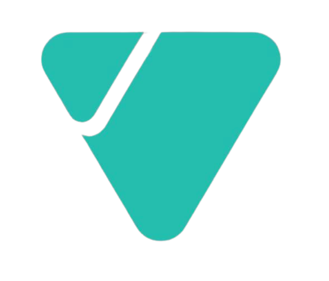

## Valuelabs
- *Machine Learning Engineer* | Feb'21 - Aug'22
- 
- Tags: Full time
- Badges:
  - Azure Machine Learning [blue]
  - Timeseries modelling [red]
  - Natural Language Processing [green]
  - MLOps [yellow]
- List Items:
  - Developed a time-series revenue projection model using fbProphet(from Meta) for a renowned US-based laundry client to estimate region-specific profit margins and to improve their sales by 5x at poorly performing locations
  - Leveraged Azure MLStudio (Quite similar to Kubeflow) to build, automate, schedule, and deploy the time series model using Azure pipelines on Azure Kubernetes Service (AKS) and Azure Cloud Service (ACS)
  -  Developed a Question-answering model to answer complaints on Twitter for a billion dollar American photography company using GPT2 and Pytorch
  - Built a custom-engineered AutoML platform for a major Indian digital media streaming client by adding multiple features and fixing some issues in the source code of AutoSKlearn

## Crio.Do
- *Software Developer Intern* | Jun'19 - Jul'19
- 
- Tags: Internship/Co-op
- Badges:
  - Docker [blue]
  - Java [yellow]
  - MongoDB [green]
  - AWS [orange]
  - Redis [red]
  - RabbitMQ [pink]
- List Items:
  - Developed a scalable distributed backend using Java & Spring boot for a Restaurants delivery app and deployed it using AWS
  - Implemented caching using Redis to improve the query response time by 90%
  - Used RabbitMQ (Message Broker) to push real-time notifications to users and containerized the project using Docker for easy reproducibility
  - Performed Load testing using Jmeter and optimized the results using multithreading the MongoDB queries

## SRM Directorate of Learning and Development
- *Full Stack Developer Intern* | Jan'18 - Jan'19
- 
- Tags: Internship/Co-op
- Badges:
  - ReactJS [blue]
  - NodeJS [yellow]
  - MongoDB [green]
  - Docker [red]
  - Nginx [pink]
  - DevOps [orange]
- List Items:
  - Built an online skill development platform using ReactJS, NodeJS, and MongoDB for SRM university students across India
  - Deployed the web apps on the university server using Nginx to handle a DAU (Daily Active Users) of 1000+ users
  - Was involved in developing progressive web apps to bolster the efficiency of work done in the college

## Design Esthetics
- *Full Stack Developer Intern* | Dec'18 - Jan'19
- 
- Tags: Internship/Co-op
- Badges:
  - ReactJS [blue]
  - NodeJS [yellow]
  - MongoDB [green]
- List Items:
  - Developed an online e-learning platform based on competitive examinations
  - Full-stack developer - Wrote code using NodeJS, React, and MongoDB