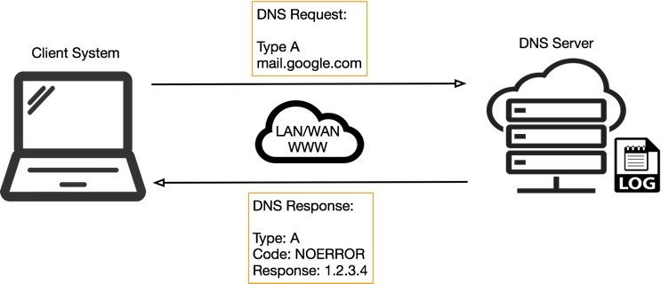

## Rhetorical Roles Classification for Indian Case Judgements
Built a sequential sentence classifier using Heirarchial BiLSTM-CRF model for SemEval2023 Task-6 (ie) Automatic annotation of Indian Case Judgements into different Rhetorical roles and optimized its score
- 
- Tags: Machine Learning
- Badges:
  - Natural Language Processing [blue]
  - Pytorch [red]
  - Huggingface [yellow]
- Buttons:
  - Link [https://github.com/skiran13/rhetorical_roles]

## DNS Exfiltration Detection
Built an Intrusion Detection System based on Stacking Classifiers and OR Logic Gate on the CIC-Bell-DNS-EXF-2021 Dataset by handling it as a live stream using a locally hosted Kafka server
- 
- Tags: Machine Learning
- Badges:
  - SkLearn [blue]
  - Kafka [green]
  - Anomaly Detection [yellow]
- Buttons:
  - Link [https://github.com/skiran13/dns_exfiltration_detection]

## NER on Medical Transcriptions
Fine-tuned BioBERT for NER task on the PubMed dataset along with manually collected medical transcription data to annotate the transcriptions as drugs, diagnosis, and treatment
- 
- Tags: Machine Learning
- Badges:
  - Natural Language Processing [blue]
  - Pytorch [red]
  - Huggingface [yellow]
- Buttons:
  - Link [https://github.com/skiran13/MedicalNER]

## Automatic Licence Plate Recognition
Trained a deep learning model to detect Licence plates and extract the Licence plate number from CCTV footage using OpenCV, darkflow and yolov2
- 
- Tags: Machine Learning
- Badges:
  - OpenCV [blue]
  - Pytorch [red]
  - YoloV2 [yellow]
  - Darkflow [green]
- Buttons:
  - Link [https://github.com/skiran13/alpr]